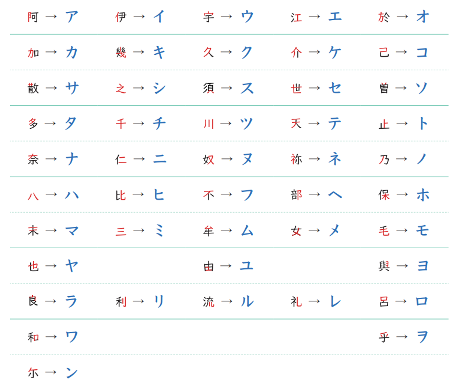

# 片假名

## 第一輪片假名字表

### 出現的片假名（依漢字來源整理）

| 片假名 | 平假名 | 漢字來源   | 讀音     | 同源？   | 記憶鉤                         |
| --- | --- | ------ | ------ | ----- | --------------------------- |
| ア   | あ   | 阿／安    | a      | ❌ 不同源 | 「阿」的左部「阝」，台語「阿」a            |
| イ   | い   | 伊／以    | i      | ❌ 不同源 | 「伊」的左部「亻」，台語「伊」i            |
| ウ   | う   | 宇      | u      | ✅ 同源  | 「宇」簡化，台語「宇」û                |
| コ   | こ   | 己      | ko     | ✅ 同源  | 「己」方形化，こ有尾巴コ方形收口            |
| ケ   | け   | 介／計    | ke     | ❌ 不同源 | ケ←「介」中部；け←「計」，漢字不同          |
| キ   | き   | 幾      | ki     | ✅ 同源  | 「幾」骨架簡化，片假名筆畫更少             |
| ク   | く   | 久      | ku     | ✅ 同源  | 「久」右上，く圓ク有稜角                |
| ス   | す   | 須      | su     | ❌ 不同源 | 「須」右部，比す少一個圈                |
| ズ   | ず   | 須＋゛    | zu     | ❌ 不同源 | ス加濁點，s→z                    |
| サ   | さ   | 散／左    | sa     | ❌ 不同源 | サ←「散」左上兩橫一撇；さ←「左」           |
| シ   | し   | 之      | shi    | ✅ 同源  | 「之」三點橫排→シ，像笑臉 :) ；し是同字但垂線彎右 |
| セ   | せ   | 世      | se     | ✅ 同源  | 「世」幾乎未變，字形最接近的一組            |
| タ   | た   | 多／太    | ta     | ❌ 不同源 | タ←「多」上部；た←「太」               |
| チ   | ち   | 千／知    | chi    | ❌ 不同源 | チ←「千」變形；ち←「知」               |
| テ   | て   | 天      | te     | ✅ 同源  | 「天」上兩橫→テ，和て同源               |
| デ   | で   | 天＋゛    | de     | ✅ 同源  | テ加濁點，t→d                    |
| ト   | と   | 止      | to     | ✅ 同源  | 「止」右半一豎一短橫→ト                |
| ニ   | に   | 仁      | ni     | ✅ 同源  | 「仁」右部兩橫→ニ，⚠️ 不是數字「二」        |
| ハ   | は   | 八／波    | ha     | ❌ 不同源 | ハ←「八」；は←「波」，字形有點像但完全不同路     |
| バ   | ば   | 八＋゛    | ba     | —     | ハ加濁點，h→b                    |
| パ   | ぱ   | 八＋゜    | pa     | —     | ハ加半濁點，回到古代 p 音              |
| ヒ   | ひ   | 比      | hi     | ✅ 同源  | 「比」右半→ヒ                     |
| ビ   | び   | 比＋゛    | bi     | —     | ヒ加濁點，h→b                    |
| フ   | ふ   | 不      | fu     | ✅ 同源  | 「不」頂部彎鉤→フ                   |
| プ   | ぷ   | 不＋゜    | pu     | —     | フ加半濁點，回到古代 p 音              |
| ホ   | ほ   | 保      | ho     | ✅ 同源  | 「保」右半木字旁→ホ                  |
| ラ   | ら   | 良      | ra     | ✅ 同源  | 「良」上部→ラ，台語「良」liông，r/l 接近   |
| ル   | る   | 流／留    | ru     | ❌ 不同源 | ル←「流」右下；る←「留」               |
| レ   | れ   | 礼      | re     | ✅ 同源  | 「礼」幾乎未變，和れ都是最接近的            |
| ロ   | ろ   | 呂      | ro     | ✅ 同源  | 「呂」上半方框→ロ，台語白話「呂」lū         |
| ワ   | わ   | 和      | wa     | ✅ 同源  | 「和」右部→ワ                     |
| ン   | ん   | 尓／无    | n      | ❌ 不同源 | ン←「尓」；ん←「无」，撇短向左收           |
| ー   | —   | （長音符號） | 延長前面母音 | —     | 片假名專用，平假名不用這個符號             |

### ⚠️ 最容易混淆的四組

|片假名|讀音|分辨訣竅|
|---|---|---|
|シ|shi|三點**橫**排，像笑臉 :)|
|ツ|tsu|三點**直**排，像哭臉|
|ソ|so|一長撇，往**右**拉|
|ン|n|一短撇，往**左**收|

## 第一輪24個單字

### 飲食（8個）

|片假名|讀音|意思|英文來源|記憶鉤|
|---|---|---|---|---|
|コーヒー|kōhī|咖啡|coffee|唸出來就是 coffee|
|ビール|bīru|啤酒|beer|唸出來就是 beer，台語借詞 bih-luh|
|ワイン|wain|葡萄酒|wine|唸出來就是 wine|
|ケーキ|kēki|蛋糕|cake|唸出來就是 cake|
|アイス|aisu|冰／冰淇淋|ice|唸出來就是 ice|
|スープ|sūpu|湯|soup|唸出來就是 soup|
|パン|pan|麵包|葡文 pão|葡萄牙語進入日語，不是英文 pan|
|チーズ|chīzu|起司|cheese|唸出來就是 cheese|

### 交通餐廳（8個）

|片假名|讀音|意思|英文來源|記憶鉤|
|---|---|---|---|---|
|タクシー|takushī|計程車|taxi|唸出來就是 taxi，台語借詞|
|バス|basu|公車|bus|唸出來就是 bus|
|ホテル|hoteru|飯店|hotel|唸出來就是 hotel|
|トイレ|toire|廁所|toilet|唸出來就是 toilet|
|チケット|chiketto|票|ticket|ッ是促音——停頓一拍再爆發，t→tt|
|セール|sēru|特賣|sale|唸出來就是 sale|
|サイズ|saizu|尺寸|size|唸出來就是 size|
|レシート|reshīto|收據|receipt|唸出來就是 receipt|

### 購物場所（4個）

|片假名|讀音|意思|英文來源|記憶鉤|
|---|---|---|---|---|
|レストラン|resutoran|餐廳|restaurant|唸出來就是 restaurant|
|コンビニ|konbini|便利商店|convenience store|コンビニエンスストア 縮略|
|デパート|depāto|百貨公司|department store|デパートメント 縮略，d→de|
|スーパー|sūpā|超市|supermarket|スーパーマーケット 縮略|

### 台語借詞（1個）

|片假名|讀音|意思|英文來源|記憶鉤|
|---|---|---|---|---|
|ライター|raitā|打火機|lighter|台語「來打」lâi-tah，English → 日語 → 台語三層借用|

## 發音規則補充（片假名專用）

|規則|說明|例子|
|---|---|---|
|**長音符號 ー**|平假名用う或い延長，片假名一律用ー|コーヒー（kōhī）、セール（sēru）|
|**促音 ッ**|っ的片假名版，停頓一拍再爆發|チケット（chiketto）→ t 停頓一拍|
|**濁點 ゛**|清音加兩點變有聲|タ→ダ、ス→ズ、テ→デ、ハ→バ|
|**半濁點 ゜**|は行專用，回到古代 p 音|ハ→パ、ヒ→ピ、フ→プ|

## 第二輪預告

下一輪將學習：

**日常生活科技詞** テレビ・カメラ・パソコン・インターネット・バッテリー・アプリ・ゲーム・メール・ビル・マンション・サービス・ルール・ポイント

新出現的片假名：ビ・マ・ン・カ・イ・タ・ネ・ッ・ゲ・メ・ル・サ・ポ 等
