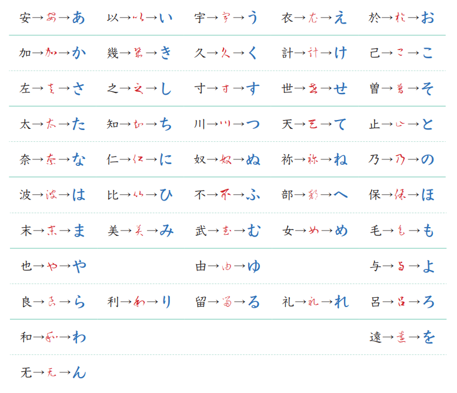

# 平假名

## 一、目前學過的平假名（66字／組合）

五十音順序：あいうえお→かきくけこ→さしすせそ→たちつてと→なにぬねの→はひふへほ→まみむめも→やゆよ→らりるれろ→わをん，濁音接在各行清音後面。

| 平假名          | 發音       | 來源漢字  | 記憶鉤                                      | 出現在                  |
| ------------ | -------- | ----- | ---------------------------------------- | -------------------- |
| **あ行**       |          |       |                                          |                      |
| あ            | a        | 安     | 台語念 an，張嘴就來 → a                       | ありがとう／あお／あか          |
| い            | i        | 以     | 台語念 i                                 | おいしい／いぬ              |
| う            | u        | 宇     | 台語念 u，直接用                             | だいじょうぶ／うち            |
| え            | e        | 衣     | e音係漢字「裔」日語發音「えい」，台語發 è；草書像衣領形狀 | え？・えーと               |
| お            | o        | 於     | 台語古音發「oo」                                | おいしい／おはよう            |
| **か行**       |          |       |                                          |                      |
| か            | ka       | 加     | 台語念 ka                                | よかった                 |
| き            | ki       | 幾     | 台語念 kí                                | きゅう（九）／きょうと          |
| く            | ku       | 久     | 台語念 kú                                | ぼくは／く（九）／くろ          |
| け            | ke       | 計     | 台語念 kè                                | けさ                   |
| こ            | ko       | 己     | ko音係漢字「古」日語發音「ko」同台語發音「kóo」              | これ                   |
| **か行濁音**     |          |       |                                          |                      |
| が            | ga       | 加＋゛   | か加濁點                                     | ありがとう／がんばって          |
| ぎ            | gi       | 幾＋゛   | き加濁點，台語「技」念 gī → gi                      | おにぎり                 |
| ぐ            | gu       | 久＋゛   | く加濁點，台語「具」念 gū → gu                      | すぐ                   |
| げ            | ge       | 計＋゛   | け加濁點                                     | げんき                  |
| ご            | go       | 己＋゛   | こ加濁點，台語「五」念 gō → go                      | ご／ございます              |
| **さ行**       |          |       |                                          |                      |
| さ            | sa       | 左     | sa音係漢字「差」日語發音「sa」由台語發音「tsa」去「t」而轉來       | さん／さけ／さる             |
| し            | shi      | 之     | 台語念 tsi，接近 shi；si音係漢字「絲」日語發音「si」同台語發  | おいしい／しろ              |
| す            | su       | 寸     | 台語念 tshùn，母音 u 對應 → su                | すみません／すぐ             |
| せ            | se       | 世     | 台語發 sè，漢字字形幾乎沒變                                   | すみません／せき             |
| そ            | so       | 曾     | so音係漢字「蘇」；草書像 S 往右彎                      | そうですね／そば             |
| **さ行濁音**     |          |       |                                          |                      |
| ざ            | za       | 左＋゛   | さ加濁點 s→z，記住さ→ざ的規則即可                      | ございます                |
| じ            | ji       | 之＋゛   | し加濁點，聲帶一震動                               | だいじょうぶ／めいし           |
| ぜ            | ze       | 世＋゛   | せ加濁點，Zero → ze                           | なぜ                   |
| ぞ            | zo       | 曾＋゛   | そ加濁點 s→z → zo                            | どうぞ                  |
| **た行**       |          |       |                                          |                      |
| た            | ta       | 太     | 台語發tài，去韻尾「i」得「ta」音                      | ただいま／たこ              |
| ち            | chi      | 知     | 同「志」的台語發音；粵語「知」念 zi，接近 chi／字形像問號         | ちょっと待って              |
| つ            | tsu      | 川     | 台語發tsuan，去韻尾「an」得「tsu」音                  | っ（促音）的本體              |
| て            | te       | 天     | 台語念 tien，去「i, n」得「te」／て是「手」的發音           | ちょっと待って／がんばって        |
| と            | to       | 止     | to音係漢字「土」台語念tóo；Tokyo 東京，釘子釘地圖           | ほんとう／とり              |
| **た行濁音**     |          |       |                                          |                      |
| だ            | da       | 太＋゛   | た加濁點                                     | ただいま／だいじょうぶ          |
| づ            | zu       | 川＋゛   | つ加濁點 → zu，現代幾乎跟ず同音                       | —                    |
| ぢ            | ji       | 知＋゛   | ち加濁點，現代幾乎跟じ同音，很少用                        | はなぢ（鼻血）              |
| で            | de       | 天＋゛   | て加濁點                                     | です／ございました            |
| ど            | do       | 止＋゛   | と加濁點 t→d，と的有聲版本                          | どうして／どこ              |
| **な行**       |          |       |                                          |                      |
| な            | na       | 奈     | 台語發nāi，去韻尾「i」得「na」音                      | なな／なつ                |
| に            | ni       | 仁     | 日語漢字吳音發「にんnin」去韻尾「n」                     | に／ほんとうに              |
| ぬ            | nu       | 奴     | 華語「奴」nú，完全對應／比め多一個圈 → nu                 | いぬ                   |
| ね            | ne       | 祢     | 台語發né                                    | そうですね／ねこ             |
| の            | no       | 乃     | 係漢字「ㄋ」中古音「nó」；像漩渦帶尾巴                     | 〇〇の〇〇（⋯⋯的）           |
| **は行**       |          |       |                                          |                      |
| は            | ha／wa    | 波     | 中古漢音發「phaㄆㄚ」，由「pha」去「p」得「ha」音／當助詞念 wa    | はな／ぼくは               |
| ひ            | hi       | 比     | 古代念 pi，演變成 hi → hi                       | ひろしま／ひる／ひと          |
| ふ            | fu       | 不     | 係漢字「婦」日語發音，同台語發hū                        | ふじさん／ふく／ふゆ          |
| へ            | he       | 部     | 古代念 pe，演變成 he／注音ㄟ字形幾乎一樣 → he             | べんとう（清音版）            |
| ほ            | ho       | 保     | 台語發pó，古代念 po，演變成 ho                      | ほんとう                 |
| **は行濁音**     |          |       |                                          |                      |
| ば            | ba       | 波＋゛   | は加濁點                                     | がんばって                |
| び            | bi       | 比＋゛   | ひ加濁點 → bi                                | えび                   |
| ぶ            | bu       | 武＋゛   | 台語「武」接近 bu                               | だいじょうぶ               |
| べ            | be       | 部＋゛   | へ加濁點，英文 Bento 便當 b 音母音都對 → be            | べんとう                 |
| ぼ            | bo       | 保＋゛   | ほ加濁點，台語「無」念 bô → bo                      | ぼくは                  |
| **は行半濁音（゜）** |          |       |                                          |                      |
| ぱ            | pa       | 波＋゜   | は加半濁點，回到古代 p 音→ pa                       | いっぱい                 |
| ぴ            | pi       | 比＋゜   | ひ加半濁點 → pi                               | ぴったり                 |
| ぷ            | pu       | 不＋゜   | ふ加半濁點 → pu                               | てんぷら                 |
| ぺ            | pe       | 部＋゜   | へ加半濁點，注音ㄟ加圓圈 → pe                        | ぺこぺこ                 |
| ぽ            | po       | 保＋゜   | ほ加半濁點 → po                               | ぽかぽか                 |
| **ま行**       |          |       |                                          |                      |
| ま            | ma       | 末     | 台語念 buāt；媽媽的 ma                            | すみません／ただいま           |
| み            | mi       | 美     | 台語念 bí，mi音係來自吳音將bi鼻音化                    | すみません／みみ             |
| む            | mu       | 武     | 台語念 bú，mu音係來自吳音將bu鼻音化                     | むし／むらさき              |
| め            | me       | 女     | 台語「妹」念 bē                   | めいし                  |
| も            | mo       | 毛     | 台語念 mo                                    | もしもし／もも              |
| **や行**       |          |       |                                          |                      |
| や            | ya       | 也     | 台語念 iā                                    | やばい／やき               |
| ゃ            | ya（縮小合讀） | 也     | 小字跟前面合讀                                  | ひゃく                  |
| ゆ            | yu       | 由     | 台語發 iû                                    | きゅう／ゆき               |
| ゅ            | yu（縮小合讀） | 由     | 小字，跟前面合讀，母音變 u                           | きゅう                  |
| よ            | yo       | 與     | 一說是源自「與」之古代吳音                            | だいじょうぶ／よる            |
| ょ            | yo（縮小合讀） | 與     | 小字，跟前面合讀，母音變 o                           | じょ                   |
| **ら行**       |          |       |                                          |                      |
| ら            | ra       | 良     | 台語漳州音發 liâŋ，由「liâŋ」音去「i, ŋ」轉來             | いらっしゃいませ             |
| り            | ri       | 利     | 台語念 lī，流利的線 → ri                      | ありがとう／とり             |
| る            | ru       | 留     | 台語念 liû，r 音接近 → ru                    | ひるごはん／よる             |
| れ            | re       | 礼     | 台語發 lé，漢字右邊勾對應假名底部勾                       | これ                   |
| ろ            | ro       | 呂     | ro音係漢字「路」，台語發lōo                         | ろく／ひろしま              |
| **わ行**       |          |       |                                          |                      |
| わ            | wa       | 和     | 上古音發 hâ，漢字右邊口對應假名封閉彎                   | わかります                |
| を            | o（wo）    | 遠     | お に一橫在上面，像戴帽子——幾乎只當受詞助詞用                 | ごはんをたべる              |
| **特殊**       |          |       |                                          |                      |
| ん            | n        | 无     | 「无」通「亡」，台語念 bông，取其韻尾「ng, n」之音；打字打 nn     | すみません／がんばって          |
| っ            | （促音）     | つ縮小   | 停頓一拍再爆發，台語入聲音感接近                         | ちょっと／がんばって           |
| じゅ           | ju       | 之＋゛／由 | じ＋ゅ合讀 → ju                               | じゅう                  |

### 漢字部件投影法（辨別形近字）

平假名來自漢字草書，漢字右邊的部件會直接投影到假名的形狀。

| 字  | 來源漢字 | 漢字右邊部件    | 假名對應筆畫  |
| --- | ---- | --------- | ------- |
| れ  | 礼    | 有**勾**    | 底部有勾    |
| わ  | 和    | 有**口**（封閉）| 有封閉的彎   |
| ね  | 祢    | 有**口＋兩點** | 有圈再甩出去  |

さ vs ち：最後一筆方向相反，互為鏡像——さ往左，ち往右。

---

## 二、目前學過的發音規則

### 規則一：濁點（゛）

清音加右上角兩點，聲母變有聲版本。聲帶開始震動。

| 清音     | 濁音     | 變化     |
| ------- | ------- | ------- |
| か（ka）  | が（ga）  | k → g   |
| さ（sa）  | ざ（za）  | s → z   |
| し（shi） | じ（ji）  | sh → j  |
| せ（se）  | ぜ（ze）  | s → z   |
| た（ta）  | だ（da）  | t → d   |
| て（te）  | で（de）  | t → d   |
| と（to）  | ど（do）  | t → d   |
| は（ha）  | ば（ba）  | h → b   |
| ひ（hi）  | び（bi）  | h → b   |
| ふ（fu）  | ぶ（bu）  | f → b   |
| へ（he）  | べ（be）  | h → b   |
| ほ（ho）  | ぼ（bo）  | h → b   |
| こ（ko）  | ご（go）  | k → g   |

**は行規律**：古代發音是 p 行，現在清音是 h，加濁點是 b。台語保留古音，所以台語 b 音（無 bô、馬 bé）和は行濁音非常接近。

### 規則二：半濁點（゜）

は行加右上角小圓圈（゜），回到古代的 p 音。

| は行清音  | 半濁音    | 變化    |
| ------- | ------- | ------ |
| は（ha）  | ぱ（pa）  | h → p  |
| ひ（hi）  | ぴ（pi）  | h → p  |
| ふ（fu）  | ぷ（pu）  | f → p  |
| へ（he）  | ぺ（pe）  | h → p  |
| ほ（ho）  | ぽ（po）  | h → p  |

は行古代念 p → 演變成 h（清音）／b（濁音゛）／p（半濁音゜）

### 規則三：小字合讀（拗音）

ょ・ゅ・ゃ 縮小時，跟前面的字合併成一個音節，母音被小字取代。

| 小字 | 本體    | 例子              |
| --- | ------ | ---------------- |
| ょ  | よ（yo） | じ＋ょ → じょ（jo）    |
| ゅ  | ゆ（yu） | き＋ゅ → きゅ（kyu）   |
| ゃ  | や（ya） | ひ＋ゃ → ひゃ（hya）   |

小字永遠不單獨發音。

### 規則四：長音

長音是**同母音延長**，寫法依母音不同而異：

| 母音    | 長音寫法  | 例子             |
| ------ | ------- | --------------- |
| a（あ）  | あ＋あ   | おかあさん（kaa）媽媽  |
| i（い）  | い＋い   | おいしい（ii）好吃    |
| u（う）  | う＋う   | ふつう（fuu）普通    |
| e（え）  | え＋い   | せんせい（ee）老師    |
| o（お）  | お＋う   | おとうさん（too）爸爸  |

**注意**：e 行的長音用**い**延長，不是え——聽起來像 ee，但寫的是 ei。正式羅馬拼音用長音符號：ā・ī・ū・ē・ō

### 規則五：ん 的特殊性

唯一不能獨立成音節的平假名，永遠附在其他字後面收尾。打字時要打 **nn** 避免被誤判成 n＋母音。

### 規則六：っ（促音）

つ 的縮小版，本身不發音，讓後面的子音停頓一拍再爆發。台語入聲字的喉塞音收尾感覺非常接近！

> ちょっと（cho・pause・to）　がんばって（gan・pause・ba・tte）

### 規則七：は 的雙重身份

| 情況    | 發音 | 例子             |
| ------ | --- | --------------- |
| 一般字   | ha  | はな（hana）花      |
| 當主語助詞 | wa  | ぼくは（boku wa）我  |

### 規則八：母音無聲化

日語的 **i** 和 **u** 在清音之間、句尾、語速快時會幾乎消音。

| 單字     | 寫法       | 實際聽感              |
| ------- | --------- | ------------------- |
| です     | desu      | des（u 幾乎消失）       |
| ます     | masu      | mas（u 幾乎消失）       |
| すみません | sumimasen | s'mimasen（su 的 u 弱化）|

### 規則九：清音在單字中間的弱化

日語清音在單字中間會自然弱化（有聲化），聽起來接近濁音。

| 規律           | 例子         |
| ------------- | ----------- |
| 單字開頭清音 → 清楚清音 | **か**ります  |
| 單字中間清音 → 自然弱化 | ありが**と**う |

